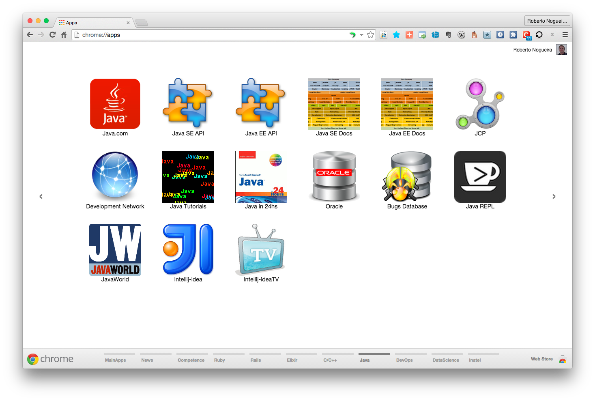

# Chrome Apps for Java


## Installation

### 1. Clone this repository and see its contents.
Open a terminal give the following command:

```bash
$ git clone https://github.com/enogrob/ChromeApps_Java.git
```

As we can see a subdirectory is created for each Java app.

```bash
$ ls -la
drwxr-xr-x@   8 enogrob  staff   272B Jun 19 05:03 ./
drwxr-xr-x+ 142 enogrob  staff   4.7K Jun 18 20:00 ../
:
drwxr-xr-x   20 enogrob  staff   680B Jun 19 05:10 ChromeApps_Java/
:

$ tree -L 1 ChromeApps_Java
ChromeApps_Java
├── images
├── Java-BugsDatabase
├── Java-DevelopmentNetwork
├── Java-EE_Docs
├── Java-EEAPI
├── Java-Glassfish
├── Java-Homepage
├── Java-Intellij-idea
├── Java-Intellij-ideaTV
├── Java-JavaIn24h
├── Java-JavaWorld
├── Java-JCP
├── Java-Netbeans.org
├── Java-Oracle
├── Java-OracleEM
├── Java-Primefaces
├── Java-REPL
├── Java-SE_Docs
├── Java-SEAPI
├── Java-Tutorials
├── Java-Wildfly
└── README.md

21 directories, 1 file
$
```

### 2. Open Chrome with the following url:
In order to load the `Chrome Apps` for Java, check `Developer Mode` and press `Load unpacked extension...` to load each App selecting its corresponding directory inside `ChromeApps_Java` e.g. `Java-Homepage`, and then repeat that for the wanted apps.

```
chrome://extensions/
```


### 3. After load the Chrome Apps wanted for Java, Chrome will look like the screenshot below:



